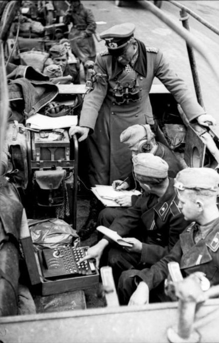

# ENIGMA
This project is a recreation of the Enigma machine, the complex cipher device used by the German military during World War II to secure communications.

<div align="center">
    
    
</div>


## Overview
This implementation not only replicates the historical functionalities of the Enigma but also integrates modern cryptographic techniques, including RSA (Rivest-Shamir-Adleman) for secure key exchange and OAEP (Optimal Asymmetric Encryption Padding) for enhanced security in encryption processes.

## Features

- **RSA Key Generation**: Generates RSA keys for secure message encryption and decryption.  

- **Message Encryption**: Encrypts plaintext messages using rotor and reflector transformations followed by RSA encryption.
- **Message Decryption**: Decrypts ciphertext using RSA decryption followed by reverse rotor and reflector transformations.
- **Custom Rotor Configuration**: Allows users to set custom rotor mappings to modify the encryption process.

## Installation

To run this project, you need to have Python installed on your machine along with the `cryptography` library. You can install the required library using pip:

```bash
pip install cryptography
```

<br>

## Usage
*To use the Enigma machine simulator, follow these steps:*

1. ***Create an instance of the*** `Enigma` **class.**
2. ***Generate RSA keys by calling the*** `generate_keys` **method.**
3. ***Encrypt a message using the*** `encrypt_full` **method.**
4. ***Decrypt a message using the*** `decrypt_full` **method.**

<br>

- ### EXAMPLE

    ```py
    from enigma import Enigma

    # Create an instance of Enigma
    enigma = Enigma()

    # Generate RSA keys
    enigma.generate_keys()

    # Set custom rotor (optional)
    enigma.change_rotor("QWERTYUIOPASDFGHJKLZXCVBNM")

    # Encrypt a message
    ciphertext = enigma.encrypt_full("Hello, World!")

    # Decrypt the message
    decrypted_message = enigma.decrypt_full(ciphertext)

    print(f"Ciphertext: {ciphertext}")
    print(f"Decrypted Message: {decrypted_message}")
    ```

## Licence
This project is licensed under the MIT License. See the [LICENSE](LICENSE) file for details.

## Contributions
Contributions are welcome. If you would like to improve this project, feel free to open an issue or submit a pull request.

## More info
- https://es.wikipedia.org/wiki/Enigma_(m%C3%A1quina)